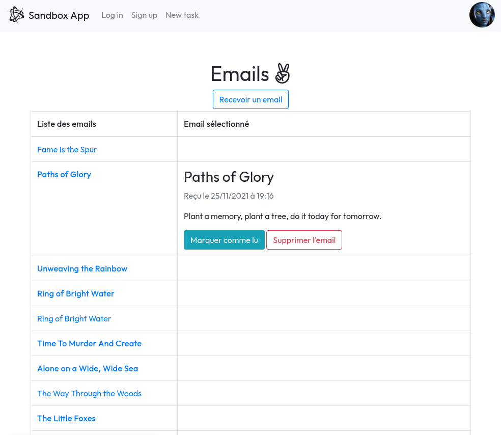

# **Gmail** remastered - en AJAX

## 1. À propos

Encore un super projet pour ce **jour 44** de la formation développeur web, un Email Viewer qui n'est ni plus ni moins qu'une version ultra basique de Gmail. Globalement l'appli affichera une seule et unique page avec 2 colonnes :
- Une colonne contenant la liste des emails en base
- Une colonne affichant le contenu de l'email sur lequel l'utilisateur vient de cliquer.

Voici les requis :

1. Une view index affichant tous les mails
1. Ajouter un mail à la liste en AJAX
1. Afficher le contenu d'un mail en AJAX
1. Supprimer un mail en AJAX
1. Gérer les transitions lu/non lu en AJAX aussi
1. *Faire une requête HTTP en JavaScript/AJAX pour afficher un mail*

*Les points en italique ne sont pas encore implémentés*

## 2. Prérequis à l'installation

1. Ruby en version 2.5.1
1. Rails en version 5.2.1
1. PostgreSQL

## 3. Lancement de l'application

L'application est disponible en production sur :

> [**https://shrouded-lowlands-27253.herokuapp.com/**](https://shrouded-lowlands-27253.herokuapp.com/)

Pour l'ouvrir en mode développement :

1. Ouvrir un terminal dans le dossier racine de l'application
1. `bundle install` -> pour installer toutes les gems nécessaires
1. `rails db:create db:migrate db:seed` -> préparation de la base de données
1. `rails s` -> lancement du serveur
1. [Accéder à la page web](http://localhost:3000/accueil)
1. Enjoy :smile:

## 4. Aperçu

## 5. Une question? Une remarque?

Postez votre requête [ici](https://github.com/joffrey7486/To_do_list_THP/issues/new/choose)  :smile:

## 6. Crédits

Une belle journée en pair-programming chez [TheHackingProject](https://www.thehackingproject.org) !

Les try-harders du moment, pour vous servir :

- [joffrey7486](https://github.com/joffrey7486)
- [fleopaulD](https://github.com/fleopaulD)
- et le précieux soutien de la communauté THP :sparkling_heart:
